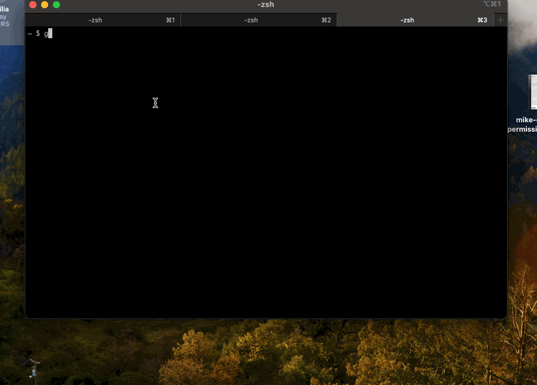

# guardian-epub

Need to read the latest edition of the Guardian newspaper on your Kindle? This is the app for you.

A Node application that will create an ePub book from the current edition of the Guardian, as created from the [Guardian's Open Platform](https://open-platform.theguardian.com/).

## Pre-requisites

To run this app, you will need:

1. [NodeJS](https://nodejs.org/) installed on your PC. Node is available for Windows, Macintosh and Linux. You should install version 18 or higher. Alternatively, as of version 1.2.0, you can use the standalone installers for Windows, Mac (ARM only) and Linux. You can find these on the Git page for this project.
2. A Guardian API key. You will need to register for this at [Guardian Open Platform access](https://open-platform.theguardian.com/access/). They are free for non-commercial use.
3. A Kindle or some other kind of ePub reader.

## Installing the Package

### With Node Installed

guardian-epub is command line interface (CLI) application. It must be run from a terminal, such as:

- Windows: Git Bash or Powershell
- Macintosh: Terminal or iTerm
- Linux: various, check your distro's documentation

To install the app if you have Node installed, the command is:

```bash
npm install -g guardian-epub
```

Note: you can also use `npx` to avoid installing the package as a separate step. See **NPX Method** section below

### Without Node Installed

Download the binary zip file for your machine time from the Releases section on the right. Binaries are available for Windows, Mac (ARM and Intel) and Linux.

Unzip the zip file to a folder somewhere your machine. The executable that you need to run will be in the /bin sub-folder of the folder to which you extracted the zip file.

## Running the Package

### Node Version

After installation, the command to begin the creation of the Guardian ePub file is:

```bash
guardianEpub
```

just on its own.

#### NPX Method

To use `npx` and avoid installing the package as a separate step, the syntax is like this:

```bash
npx -p guardian-epub@latest -y guardianEpub
```

### Standalone Binaries (without Node) Version

In the folder to which you extracted the zip file, `cd` to the /bin sub-folder. The command to run the app will be:

For Windows (Powershell):

```bash
.\get-guardian.exe
```

For ARM Mac (iTerm):

```bash
./get-guardian-mac
```

For Linux:

```bash
./get-guardian-linux
```

#### Permissions

For Mac and Linux, if you get a "permission denied" error when you try to run the executable then you will need to set execution permissions like so:

```bash
chmod +x ./get-guardian-mac
```

The executable should now run.

### Enter API Key

The first time that you run the package, it will prompt you to type/paste in your Guardian API key.

After that, the key will be stored in a config file and you will not need to enter it again.

### Select your sections

The script will then present you with all the sections that are available. Pick the ones that you want to be in your ePub, using the on-screen command keys. All articles from your selected sections will be downloaded.

Hit the Return/Enter key when you're done.

### Re-order you sections (optional)

By default, your sections will appear in the your ePub alphabetically, which is probably not what you want. So the script will ask you to put them in order, using the on-screen keys again.

Again, hit the Return/Enter key when you're done. (See below for issue with the default Macintosh Terminal app.)

Your chosen order will stored in a different config file, and that order will be used the basis for all future section selections.

### Reselecting sections (optional)

By default, the app uses your saved sections without prompting you again. If you want to reselect and/or reorder your sections, pass the `--selections` switch. The syntax is:

```bash
guardianEpub --selections
```

Or if you're using the `npx` syntax:

```bash
npx -p guardian-epub@latest -y guardianEpub --selections
```

First run note: if no sections are saved yet, the app will prompt you even if you don't pass `--selections`.

### Demo

The animated GIF below shows the process of creating the ePub, and then opening it and reading it in the Calibre eReader.



I've edited this animation to cut out the dull bits, such as the waiting for the API calls to complete. It's slower than this in real life, especially if you select a lot of sections.

I've also skipped the part where you have to enter API key, as you'll likely only ever do that once.

## Troubleshooting

### Changing your API Key (Node version only)

If you need to re-enter your Guardian key, you can run the command:

```bash
guardianEpubKey
```

The package will prompt you to enter your key again.

Alternatively, you can enter the config file directly. The file path to the config file is:

~/.guardianEpub/guardian-open-platform-key.json

Where "~" is your home folder, which will be different depending on your Operating System, but should be based around your user name.

As per its extension, the file is a JSON file, and should look like this:

```json
{
  "API_KEY": "put_your_key_here"
}
```

Add or change your Guardian API Platform key dswhere it says "put_your_key_here".

If you're using the (non Node) binaries, then you will have to edit this file manually. This command should do it on most platforms:

```bash
nano ~/.guardianEpub/guardian-open-platform-key.json
```

Use ctrl->x keystroke to exit Nano and save your changes.

## Known Issues / Limitations

### Sorting on Macintosh

Sort doesn’t work with Mac’s default terminal app, which is actually called Terminal. This is [known issue](https://github.com/enquirer/enquirer/issues/206) with how Terminal handles the Shift key . There’s [a workaround](https://superuser.com/questions/841391/os-x-terminal-eating-the-shift-key) but I haven’t tested it, so use at your own risk. My recommendation is to install and use [iTerm](https://iterm2.com/index.html), which works correctly.

## Developing The App

For development setup, architecture notes, and build details, see the developer guide:

[DEVELOPER_GUIDE.md](./DEVELOPER_GUIDE.md)

## Changelog

For more information on what has changed recently, see the [CHANGELOG](CHANGELOG.md).

## Disclaimer

This NPM package, guardian-epub, is an independent project and is not affiliated with, officially maintained, authorized, endorsed, or sponsored by Guardian News and Media Limited or any of its affiliates or subsidiaries. This package is provided "as is", without warranty of any kind, express or implied.

The use of The Guardian's trademarks, brand names, or logos in this package is for identification and reference purposes only and does not imply any association with the trademark holder.

Any trademarks and brand names mentioned in this document or in the guardian-epub package are the property of their respective owners.
